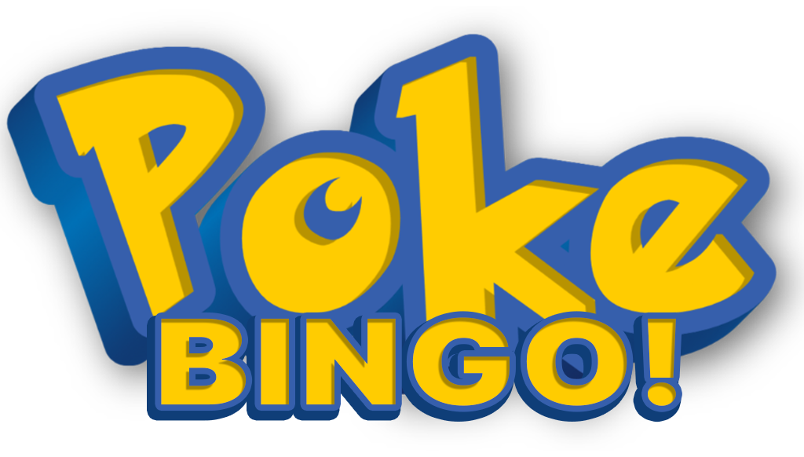
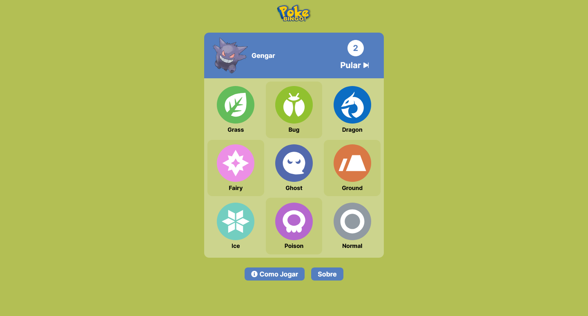

<h1 align="center">
    
</h1>

<h2 align='center'><a href='https://poke-bingo-wendell-correa-limas-projects.vercel.app/' target='_blank' style='display: block; color: #b3bf54; font-weight: bold; margin: 30px'>Acessar Site</a></h2>

<h2 style='color: #b3bf54; border-bottom:none'>Descrição do projeto:</h2>

    O <a href='https://poke-bingo-wendell-correa-limas-projects.vercel.app/' target='_blank' style='color: #b3bf54; font-weight: bold;'>PokeBingo</a> é um desafio diário de bingo com espécies de Pokémon. Serão apresentadas espécies aleatórias e você deverá responder a qual dos tipos de espécies na cartela de bingo elas correspondem. Um novo bingo é gerado todos os dias.
    Este projeto foi contruído utilizando e consumindo a <a href='https://pokeapi.co/' target='_blank' style='color: #b3bf54; font-weight: bold;'>PokeAPI</a>, uma grande fonte de dados sobre Pokémon.
    <a href='https://poke-bingo-wendell-correa-limas-projects.vercel.app/' target='_blank' style='display: block; color: #b3bf54; font-size: 20px; font-weight: bold; margin-top: 30px'>Clique aqui para acessar o projeto completo.</a>

    

<h2 style='color: #b3bf54; border-bottom:none'>Tecnologias utilizadas:</h2>
<ul style='list-style: none; list-style-type: none; display: grid; grid-template-columns: repeat(3, 1fr); gap: 16px'>
    <li style='display: flex; flex-direction: column; align-items: center; margin-right: 30px'>
        
        NexJS
    </li>
    <li style='display: flex; flex-direction: column; align-items: center; margin-right: 30px'>
        
        React
    </li>
    <li style='display: flex; flex-direction: column; align-items: center; margin-right: 30px'>
        
        MongoDB
    </li>
    <li style='display: flex; flex-direction: column; align-items: center; margin-right: 30px'>
        
        TypeScript
    </li>
    <li style='display: flex; flex-direction: column; align-items: center; margin-right: 30px'>
        
        Tailwind
    </li>
    <li style='display: flex; flex-direction: column; align-items: center; margin-right: 30px'>
        
        Sass
    </li>
    <li style='display: flex; flex-direction: column; align-items: center; margin-right: 30px'>
        
        JavaScript
    </li>
    <li style='display: flex; flex-direction: column; align-items: center; margin-right: 30px'>
        
        CSS
    </li>
    <li style='display: flex; flex-direction: column; align-items: center; margin-right: 30px'>
        
        HTML
    </li>
</ul>
